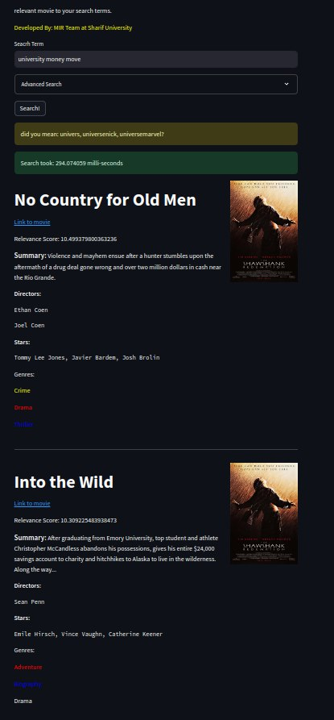
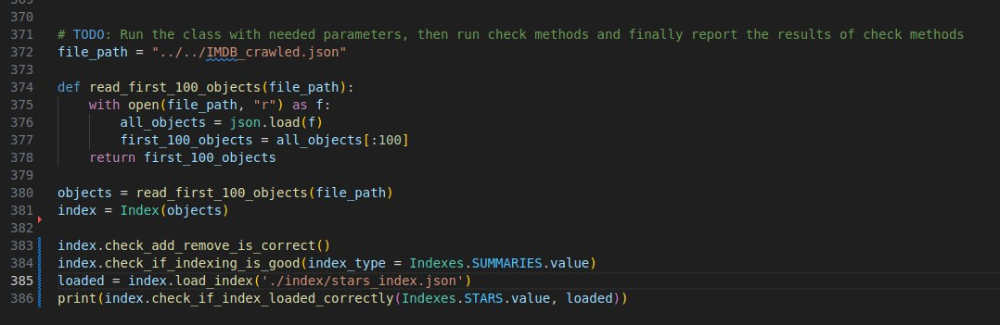
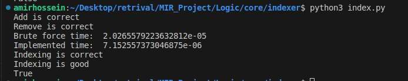
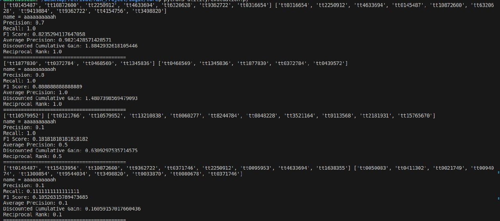
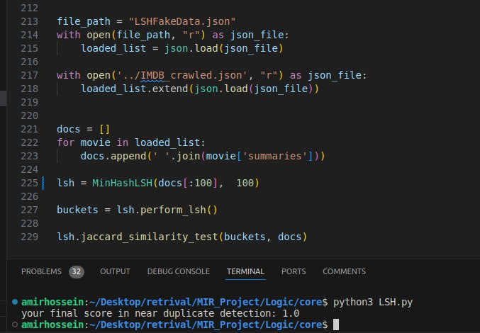
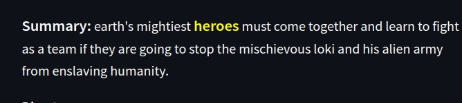

# Phase 1

All modules and necessary functionality have been implemented. The search engine works great. In fact, I inputted some random words and after searching, the second result absorbed me, as I have watched that before and it was a perfect fit for those words, even though they might not be a good combination of words.

For indexing, I ran the code and it passed the tests (I built it for the first 100 movies). At the end, I built the full indexes and ran everything on the full crawled data, but some of the tests were just on the first 100 movies.

As I explained, I added an index_builder module to build all needed indexes and preprocess them all in one place. Many of the added things are self-explanatory, and I refuse to give a full explanation here.

For the evaluation, I crawled the IMDb search engine and I picked the intersection of its results with my original crawled data to have a better estimate of recall or other metrics. But after all, some of the queries weren't good enough and estimators got an exact match because of IMDb search engine properties. Here are the results for the first 4 queries:

I ran the LSH test for the first 80 movies + the 20 fake movies with 10 rows and 10 bands:

And I didn't force the user to use my spell correction suggestion as it was the default in the template; I just suggested some near terms.

For the snippet, I tried to find more difficult words other than the raw word itself:

